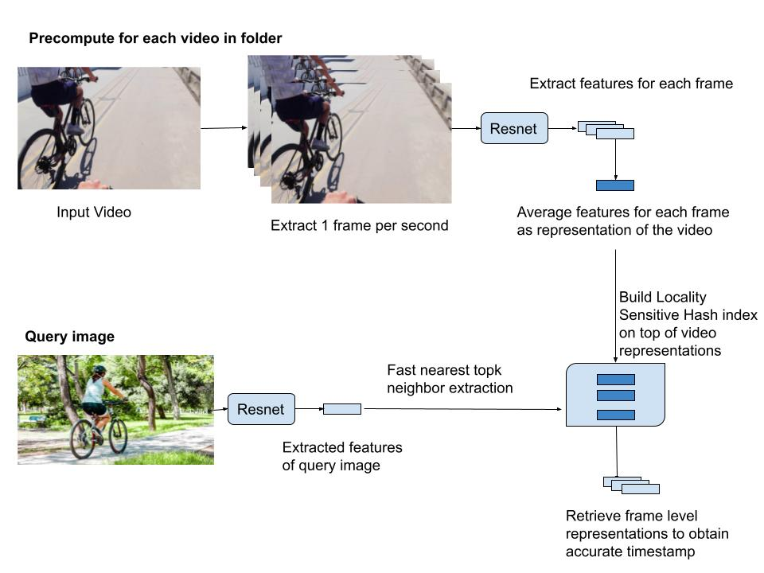

## Diagrammatic overview of the system architecture



## Prerequisites
- Linux or macOS
- Python 3
- OpenCV

## Getting Started
- Clone this repo:
```
git clone https://github.com/arnabgho/video_retrieval
cd video_retrieval
```
- Install PyTorch 1.0+ and dependencies from http://pytorch.org
- Install Torchvision
- Install all requirements
```
conda create -n 'video_retrieval' python=3.6
conda activate video_retrieval
pip install -r requirements.txt
```

### Run the similarity command

```
python similarity.py --image './CV_Challenge_data/images/biking.jpg' --video_folder './CV_Challenge_data/videos/' --topk 2
```
